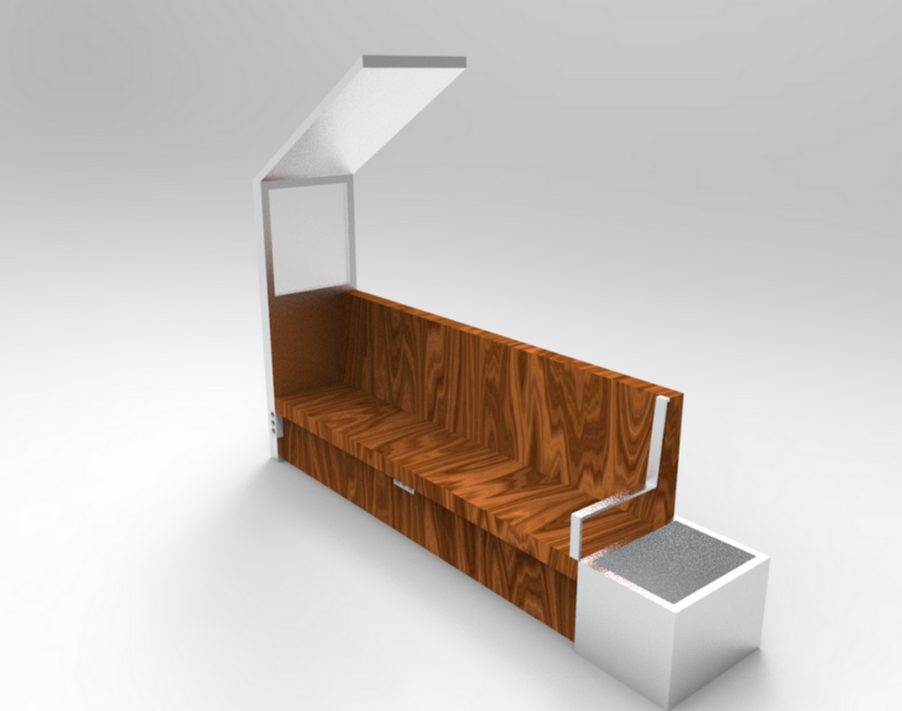

# **La Panca**
## Seduta multifunzione opensource co-progettata

## Comune di Torino, Bando AXTO per le periferie Torinesi
### Progetto Speciale Innovazione Fondi Europei - Smart City

**Soggetto Capofila**: [Associazione Fablab Torino](http://fablabtorino.org/)
**Partner:** Associazione Spazio Nuova Arquata  
**Durata:** 1,5 Anni   
**Progetto:** In allegato_4  
**Sinossi:** Il progetto ha come obiettivo la realizzazione di una panchina intelligente, frutto di una co-creazione con gli abitanti del quartiere, zona Via Arquata, vicino al Fablab di Torino.  
**Referente Fablab Torino:** Davide Gomba    
**Referente Spazio Nuova Arquata:** Maria Teresa Nesta  
**Team di Ricerca sul Campo / Field Design Team** TBD     
**Team di Sviluppo del Progetto / Design & Making Team:** TBD    
**Team di Sviluppo Codice ed Elettronica / Dev & HW Team:** TBD  
**Mail di riferimento**: panca@fablabtorino.org

**Descrizione:** Il progetto ha come obiettivo la realizzazione di una panchina intelligente, frutto di una co-creazione con gli abitanti del quartiere.

Gli obiettivi generali dell’intervento sono:
fornire risposte concrete tramite un dispositivo IOT ai bisogni dei giovani e degli abitanti del quartiere;
fornire un’opportunità formativa per giovani in ambito di artigianato 4.0;
facilitare la coesione sociale ed l’appropriazione degli spazi da parte degli abitanti del territorio di Via Arquata.

Come obiettivi specifici, il progetto permetterà di identificare - attraverso il confronto con uno dei simboli della collettività cittadina, la panchina - elementi per migliorare la vita dei giovani del quartiere, creando i presupposti per mantenere attiva una conversazione in piazza, conversazione “aggiornata” agli strumenti di oggi.
La panchina fornirà, nella sua versione più semplice, una connettività WIFI e la possibilità di ricaricare i cellulari. Fornirà quindi alimentazione e connettività, la nuova “moneta” con cui si misura ormai l’accesso alla cittadinanza digitale.
I giovani potranno sperimentare alcune soluzioni legate alla tecnologia connessa IOT negli ambiti individuati attraverso la fase di ricerca ed analisi dei bisogni; gli ambiti principali di intervento saranno la connettività ad internet, la possibilità di ascoltare musica, la presenza di luci led che possano reagire ai suoni, la possibilità di inserire altri sensori sulla base dell’interesse dimostrato dai ragazzi coinvolti (meteo/qualità dell’aria/altro).

